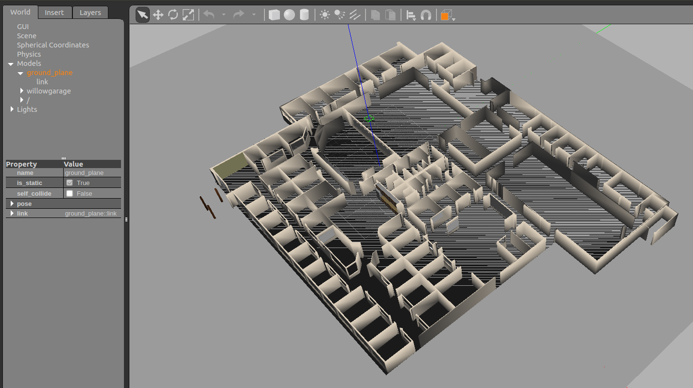
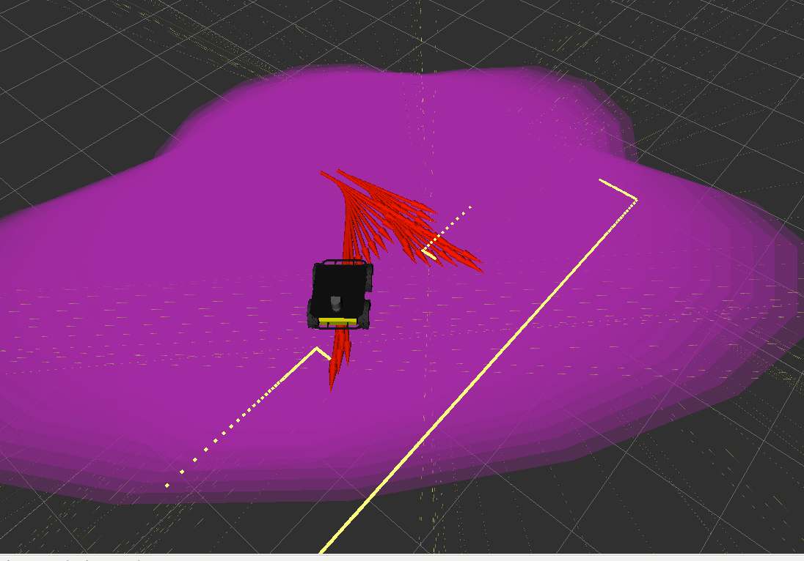
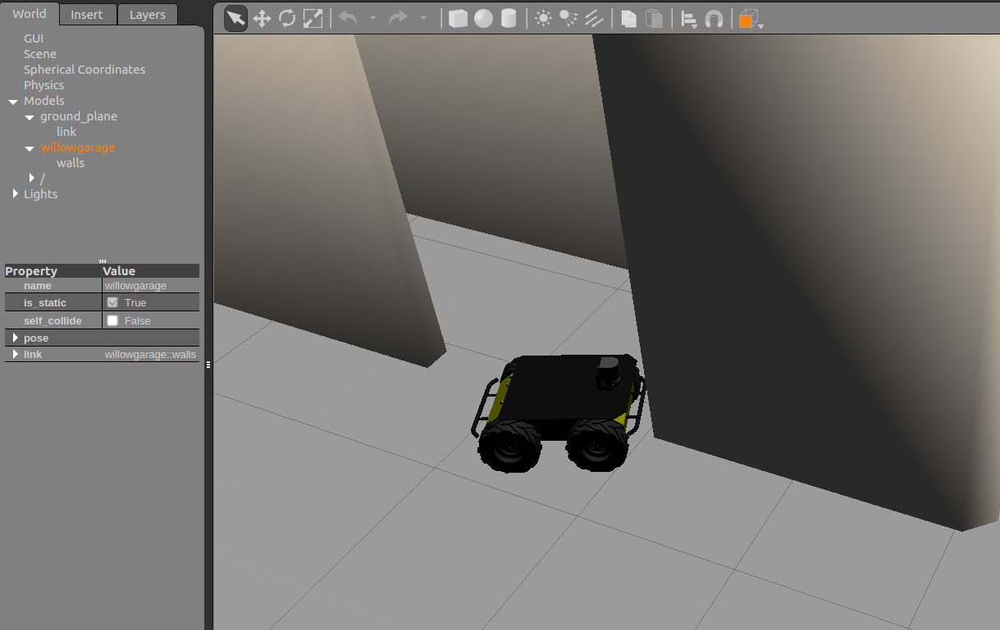

# 导航教程 
版本Kinetic

by   
Top Liu  

软件：ROS+四驱智能车  
车体：巨匠小路虎  
车载主控：树莓派Ubuntu mate 16.04 + Kinetic  
控制站PC： Ubuntu 16.04 + Kinetic  
 

## frontier_exploration
	
	Source: git https://github.com/paulbovbel/frontier_exploration.git (branch: kinetic-devel)   	

 http://wiki.ros.org/frontier_exploration
 
	sudo apt-get install ros-kinetic-frontier-exploration ros-kinetic-navigation-stage
	
Run the necessary nodes one-by-one from separate terminal:

	roslaunch navigation_stage move_base_gmapping_5cm.launch

	roslaunch navigation_stage move_base.xml

	roslaunch frontier_exploration global_map.launch
	

 

	
    roslaunch husky_navigation amcl_demo.launch	
    roslaunch husky_viz view_robot.launch

 
	
	
	
### gmapping demo

    roslaunch husky_navigation gmapping_demo.launch

保存地图

	rosrun map_server map_saver -f <filename>

例如

	rosrun map_server map_saver -f ~/husky_test/wg.map

探索
	
	roslaunch husky_navigation exploration_demo.launch
	
	
	

	
# 运行实体机器人	
## Rover配置 
首先配置网络  
1. PC  
如果PC使用的是虚拟机，需要将Nat模式改为桥接模式（不要选择下面的复制IP）  
查看PC的ip  
ifconfig     
2. 连接树莓派到本地的局域网  
将树莓派通过HDMI线连接到电脑屏幕， 通过鼠标选择当前的网络， 进行连接。  
进入路由器找到当前的无线网中， 树莓派所属的IP地址  
ifconfig   
配置下hosts文件， 便于实现分布式通信  
vi /ect/hosts  
添加下面一行  
(ubuntu主机的ip) （Ubuntu主机的名字）   
例如  
192.168.1.102 blackant-desktop  
3. 配置PC的hosts  
配置下hosts文件， 便于实现分布式通信  
vi /ect/hosts  
添加下面一行  
(树莓派的ip) （树莓派的主机名字）  
例如  
192.168.1.101 Raspberry  

## 控制
### 启动树莓派中的串口server程序
首先我们先给USB串口一个权限  
sudo chmod 777 /dev/ttyUSB0  
roscore & 
最好是到目录下启动serial_server  
cd ~/catkin_ws/devel/lib/serial_server  
./serial_server  

### PC
1. 配置PC的ROS_MASTER_URI  
export ROS_MASTER_URI=http://（树莓派的主机名字）:11311  
2.运行rviz  
roslaunch rover_rviz.launch  
3. 控制Rover跑起来  
rosrun nav_test control.py  
上下左右键控制运动  
空格 停车  

